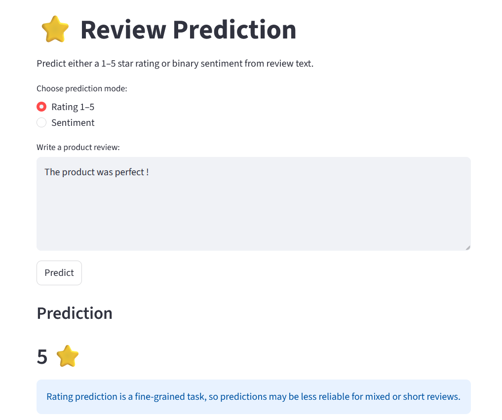
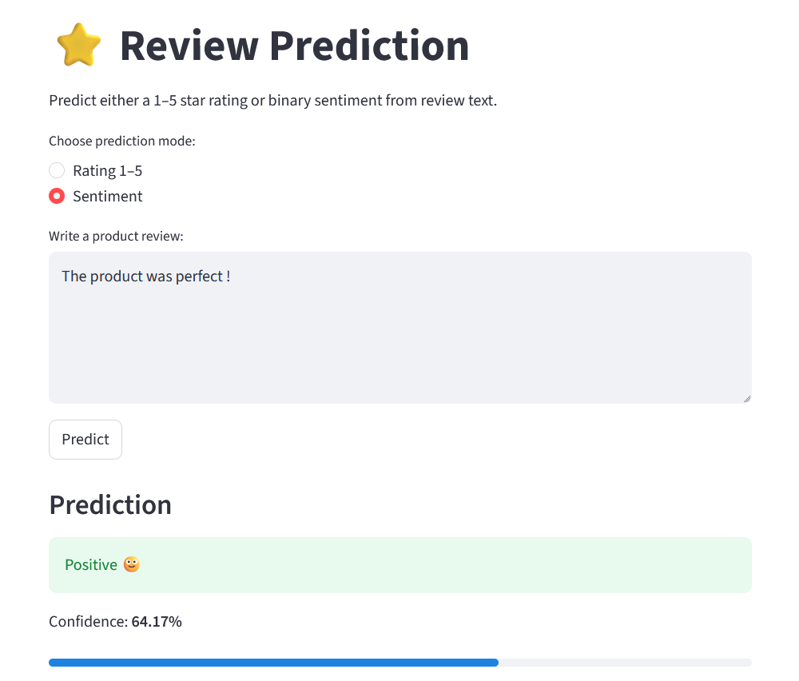
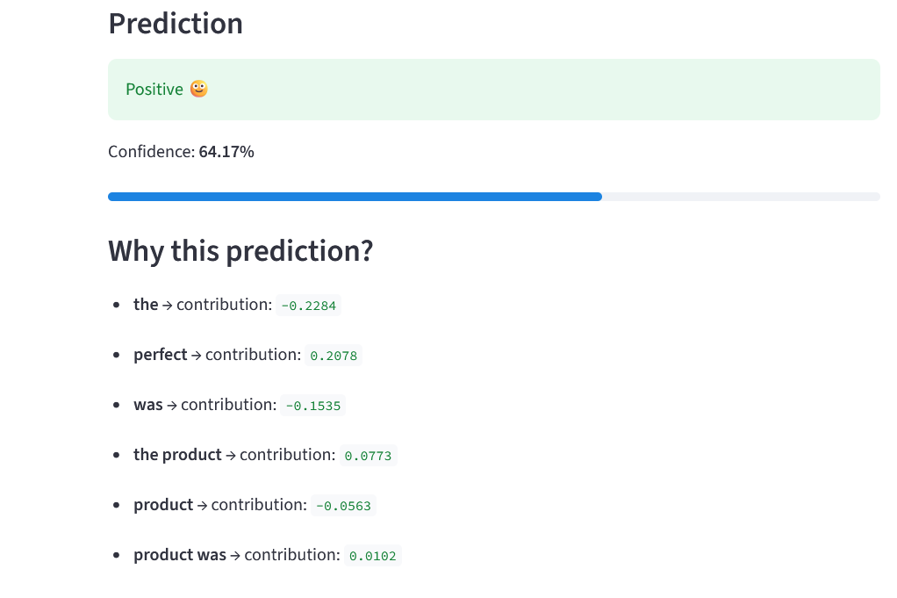

# ⭐ Review Rating & Sentiment Prediction

An end-to-end Natural Language Processing (NLP) project that predicts product ratings (1–5 stars) and sentiment (positive/negative) from user reviews.

Built with Python, Scikit-learn, and Streamlit, this project demonstrates a complete machine learning pipeline — from data preprocessing to model deployment with explainability.

---

## 🚀 Features

- 🔢 **Rating Prediction (1–5 stars)** using TF-IDF + Linear SVM  
- 😊 **Sentiment Analysis (positive/negative)** using Logistic Regression  
- 📊 **Model Evaluation** (accuracy, precision, recall, F1-score, confusion matrix)  
- 💾 **Model Persistence** (save/load trained models)  
- 🌐 **Interactive Web App** built with Streamlit  
- 📈 **Confidence Score** for predictions  
- 🔍 **Explainability**: shows which words influenced the prediction  

---

## 🧠 How It Works

1. **Data Loading & Cleaning**
   - Remove noise, normalize text  
   - Prepare reviews for processing  

2. **Feature Engineering**
   - Convert text to numerical features using **TF-IDF vectorization**  

3. **Model Training**
   - **Linear SVM** → Rating prediction (1–5)  
   - **Logistic Regression** → Sentiment classification  

4. **Evaluation**
   - Classification report  
   - Confusion matrix  
   - Error analysis (misclassified examples)  

5. **Deployment**
   - Models are saved using `joblib`  
   - Loaded into a **Streamlit app** for real-time predictions  

---

## 🖥️ Demo

### Rating Prediction
Predict a 1–5 star rating based on review text.

### Sentiment Prediction
Classify reviews as positive or negative with confidence score.

### Explainability
See which words contributed most to the model's decision.

---

## 📸 Screenshots

> Add your Streamlit screenshots here (UI, predictions, explainability)

---

## ⚙️ Installation

```bash
git clone https://github.com/your-username/review-rating-prediction.git
cd review-rating-prediction
python -m venv venv
venv\Scripts\activate   # Windows
pip install -r requirements.txt
```

## ▶️ Run the App

```commandline
streamlit run app.py
```

## 🏋️ Train Models

```commandline
python train_all.py
```

## 📁 Project Structure

```commandline
review-rating-prediction/
│
├── data/                  # Dataset
├── models/                # Saved models
├── src/
│   ├── data_loader.py
│   ├── preprocess.py
│   ├── features.py
│   ├── train.py
│   ├── evaluate.py
│   ├── explain.py
│   ├── prediction_explain.py
│   └── model_utils.py
│
├── app.py                 # Streamlit app
├── train_all.py           # Train all models
├── requirements.txt
└── README.md
```

## 📊 Results

- Rating Prediction Accuracy: ~0.78
- Strong performance on class 5 (majority class)
- Lower performance on minority classes (expected due to imbalance)
- Sentiment Model
- Balanced dataset
- More stable and interpretable predictions

## 📸 Screenshots

### ⭐ Rating Prediction


### 😊 Sentiment Prediction



## 🧩 Key Challenges

- Class imbalance (many 5-star reviews)
- Fine-grained rating prediction (1–5)
- Ambiguous middle ratings (3–4)

## 🔮 Future Improvements

🔥 Highlight important words directly in the UI

⚖️ Improve class balance (SMOTE / class weights)

🤖 Try advanced models (Random Forest, XGBoost)

🧠 Experiment with deep learning (LSTM / Transformers)

🌍 Deploy online (Streamlit Cloud / Hugging Face Spaces)

## 🧑‍💻 Author

Dimitris Loukakis 